# Analyse - Projet Quizzako

---

</br>

## Sommaire

</br>

- [1. Objectif du document](#1-objectif-du-document)
- [2. Groupe 1 : Gestion des comptes](#2-groupe-1--gestion-des-comptes)
  - [2.1 Cas d'utilisation « Request Teacher Role »](#21-cas-dutilisation-request-teacher-role)
  - [2.2 Cas d'utilisation « Grant Teacher Role »](#22-cas-dutilisation-grant-teacher-role)
- [3. Groupe 2 : Gestion des questionnaires](#3-groupe-2--gestion-des-questionnaires)
  - [3.1 Cas d'utilisation « Assign Questionnaire »](#31-cas-dutilisation-assign-questionnaire)
  - [3.2 Cas d'utilisation « Consult Questionnaire Results»](#32-cas-dutilisation-consult-questionnaire-results)
  - [3.3 Cas d'utilisation « Create Questionnaire »](#32-cas-dutilisation-create-questionnaire)
  - [3.4 Cas d'utilisation « Answer Question Series »](#32-cas-dutilisation-answer-question-series)
- [4. Groupe 3 : Gestion de la Progression](#4-groupe-2--gestion-de-la-progression)
  - [4.1 Cas d'utilisation « Consult overall score»](#41-cas-dutilisation-consult-overall-score)
  - [4.2 Cas d'utilisation « Consult assigned questionnaire scores »](#42-cas-dutilisation-consult-assigned-questionnaire-scores)
- [5. Groupe 4 : Gestion des Cohortes](#5-groupe-4--gestion-des-cohortes)
  - [5.1 Cas d'utilisation « Add Student in Cohort»](#51-cas-dutilisation-add-student-in-cohort)
  - [5.2 Cas d'utilisation « Assign questionnaire to cohort »](#52-cas-dutilisation-consult-assigned-questionnaire-scores)
  - [5.3 Cas d'utilisation « Show Cohort Details »](#53-cas-dutilisation-show-cohort-details)
- [6. Regroupement des classes](#6-regroupement-des-classes)
  - [6.1. Groupe domaine](#61-groupe-domaine)
  - [6.2. Groupe domaine et cycle de vie](#62-groupe-domaine-et-cycle-de-vie)
  - [6.3. Groupe Service](#63-groupe-service)
  - [6.4. Groupe interface utilisateur et système](#64-groupe-interface-utilisateur-et-système)

</br>

## 1. Objectif du document..

Ce document contient une analyse orientée objet fondée sur l'expression des besoins du projet "Quizzako".
L'analyse suit le langage de modélisation UML et la méthodologie Arrington.

Ce document contient deux types de diagrammes UML:

- Les diagrammes de classes : les classes candidates qui se dégagent lors de l'analyse du document d'expression des besoins, groupées par stéréotypes.
- Les diagrammes de séquence : reprennent chaque cas d'utilisation du document d'expression des besoins en le modélisant dans un ou plusieurs diagrammes de séquence.

### 2. Groupe 1 : Gestion des comptes

</br>

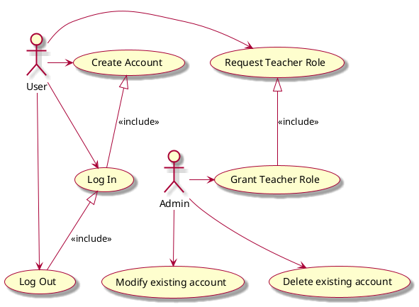

</br>

Selon le rapport risque/pertinence/priorisation pour la sélection des cas d'utilisations, les cas "Request Teacher Role" et "Grant Teacher Role" ont été retenus.

#### 2.1 Cas d'utilisation "Request Teacher Role"


##### 2.1.1 Liste des objets candidats

</br>

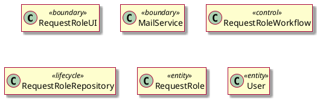
</br>

##### 2.1.2 Description des interactions entre objets

</br>

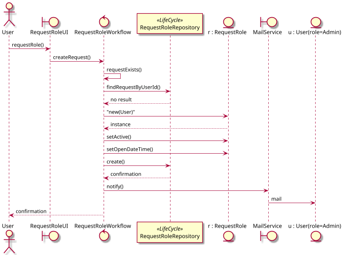
</br>

##### 2.1.3 Diagramme de classe consolidé pour le Use case

</br>

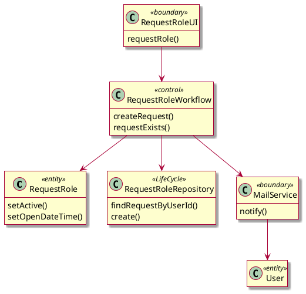

</br>

#### 2.2 Cas d'utilisation "Grant Teacher Role"

</br>

##### 2.2.1 Liste des objets candidats

</br>

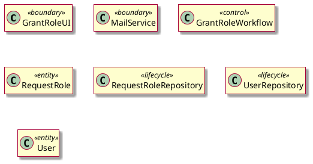

</br>

##### 2.2.2 Description des interactions entre objets

</br>

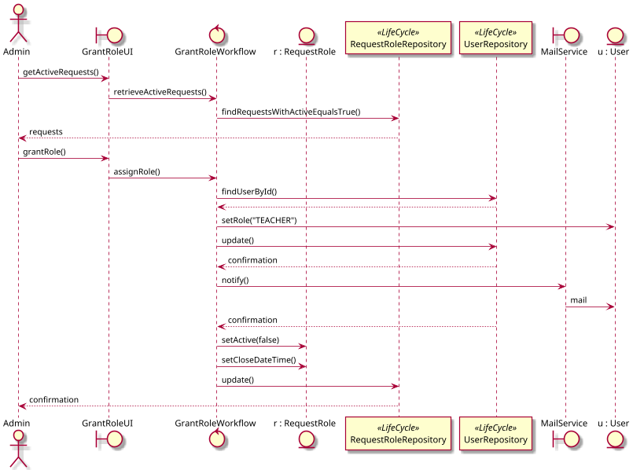

</br>

##### 2.2.3 Diagramme de classe consolidé pour le Use case

</br>

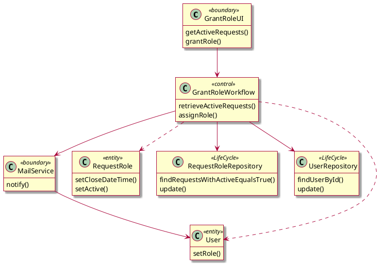

</br>

### 3. Groupe 2 : Gestion des questionnaires

</br>

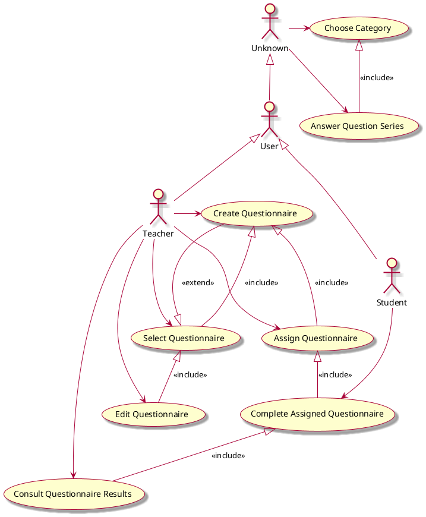

</br>
Selon le rapport risque/pertinence/priorisation pour la sélection des cas d'utilisations, 
les cas "Assign Questionnaire", "Consult Questionnaire Results", "Create Quesitonnaire" et "Answer question series" ont été retenus.

</br>

#### 3.1 Cas d'utilisation "Assign Questionnaire"

</br>

##### 3.1.1 Liste des objets candidats

</br>

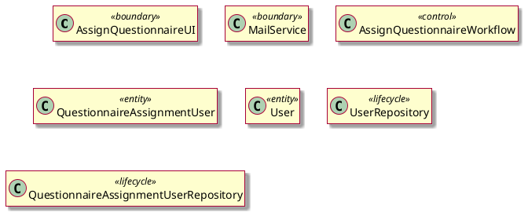

</br>

##### 3.1.2 Description des interactions entre objets

</br>

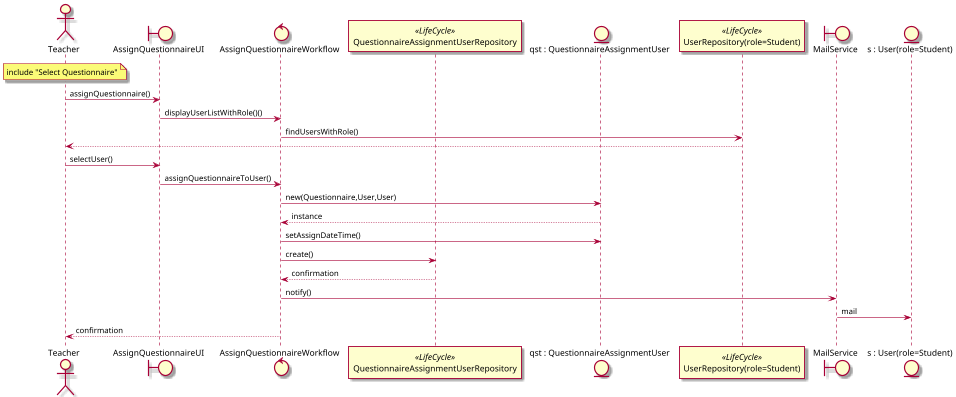

</br>

##### 3.1.3 Diagramme de classe consolidé pour le Use case

</br>

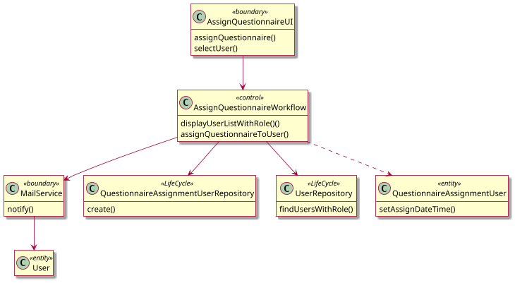


</br>

#### 3.2 Cas d'utilisation "Consult Questionnaire Results"

</br>

##### 3.2.1 Liste des objets candidats

</br>

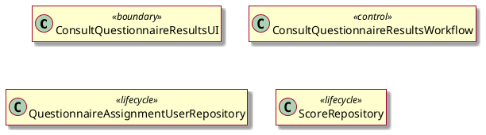

</br>

##### 3.2.2 Description des interactions entre objets

</br>

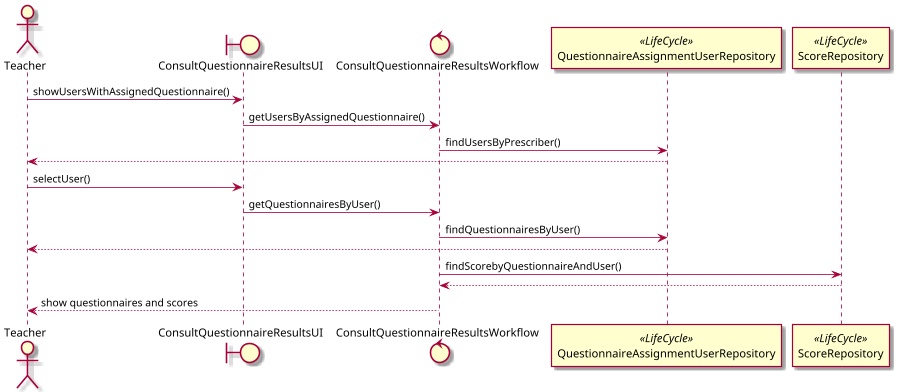

</br>

##### 3.2.3 Diagramme de classe consolidé pour le Use case

</br>

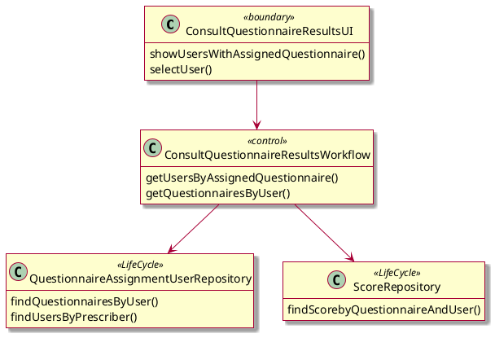


</br>

#### 3.3 Cas d'utilisation "Create Questionnaire"

</br>

##### 3.3.1 Liste des objets candidats

</br>

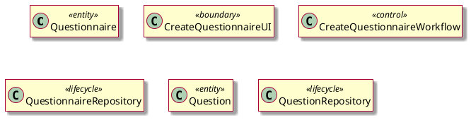


</br>

##### 3.3.2 Description des interactions entre objets

</br>

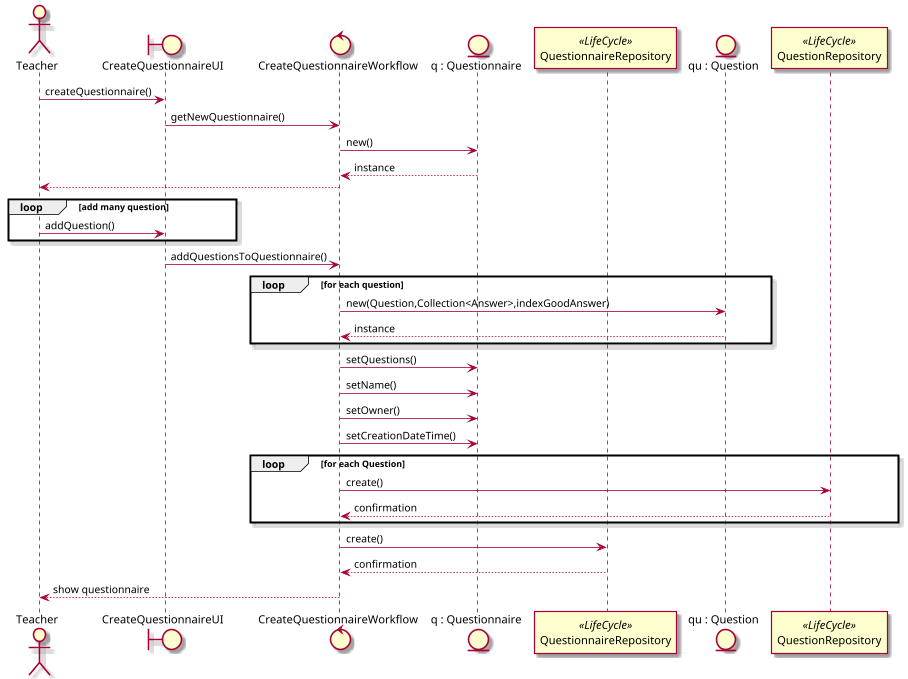


</br>

##### 3.3.3 Diagramme de classe consolidé pour le Use case

</br>

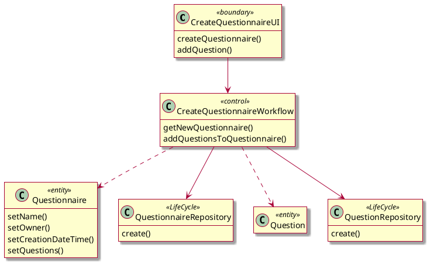


</br>

#### 3.4 Cas d'utilisation "Answer Question Series"

</br>

##### 3.4.1 Liste des objets candidats

</br>

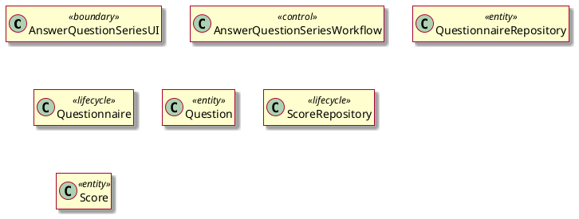


</br>

##### 3.4.2 Description des interactions entre objets

</br>

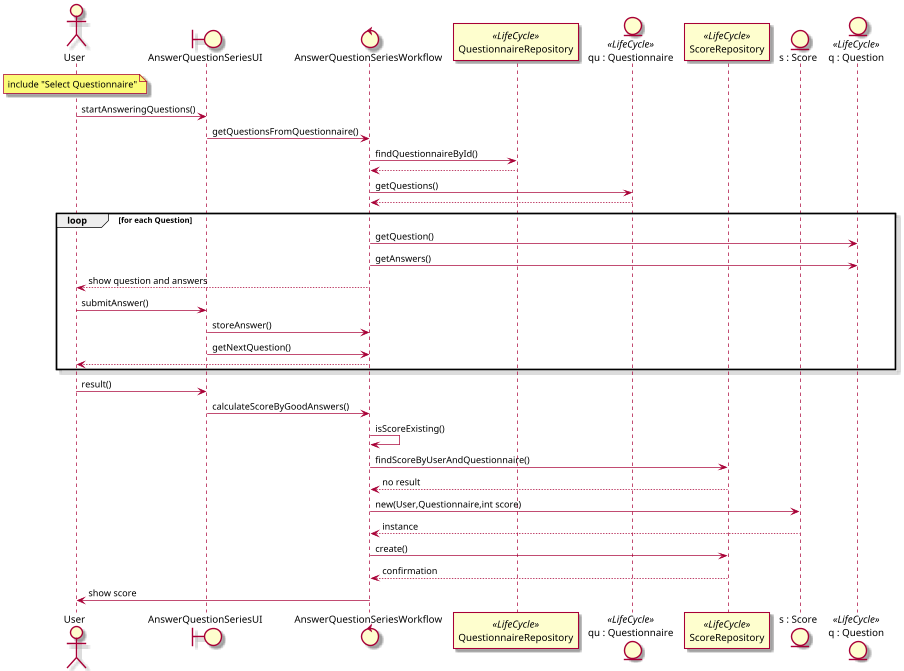

</br>

##### 3.4.3 Diagramme de classe consolidé pour le Use case

</br>

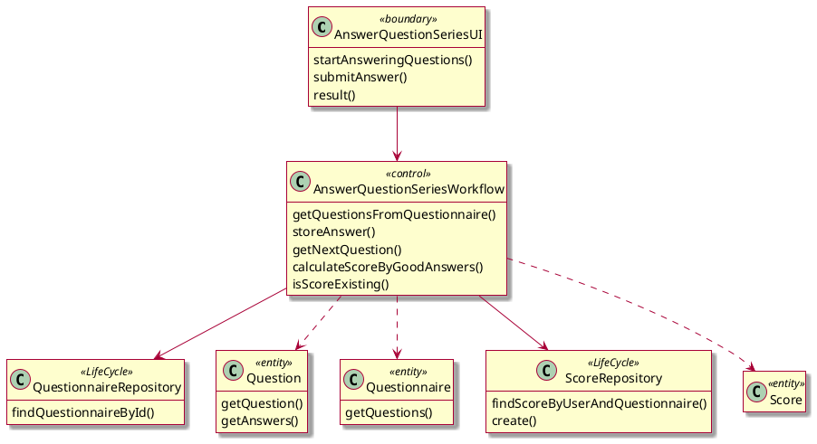

</br>

### 4. Groupe 3 : Gestion de la progression

</br>

```plantuml
@startuml
skin rose
:User: --> (Consult Category Scores)
:User: --> (Consult Overall Score)
:Student: --> (Consult Assigned Question Scores)
:User: <|-- :Student:
@enduml
```

</br>

Selon le rapport risque/pertinence/priorisation pour la sélection des cas d'utilisations, les cas "Consult overall score" et "Consult assigned questionnaire scores" ont été retenus.

</br>

#### 4.1 Cas d'utilisation "Consult overall score"

</br>

##### 4.1.1 Liste des objets candidats

</br>

```plantuml
@startuml
skin rose
hide empty members
class ConsultOverallScoreUI <<boundary>> {}
class ConsultOverallScoreWorkflow <<control>> {}
class ScoreRepository <<lifecycle>> {}
class Score <<entity>> {}

@enduml
```

</br>

##### 4.1.2 Description des interactions entre objets

</br>

```plantuml
@startuml
skin rose

actor User as u
boundary ConsultOverallScoreUI as ui
control ConsultOverallScoreWorkflow as wf
participant "ScoreRepository" as dao <<LifeCycle>>
entity "s : Score" as s

u -> ui: consultOverallScore()
ui -> wf: getUserOverallScore()
wf -> dao: findScoresByUser()
dao --> wf
loop on Score objects
wf -> s: getScore()
end
wf -> wf : agregateQuestionairesScores()
wf --> u: show overall score

@enduml
```

</br>

##### 4.1.3 Diagramme de classe consolidé pour le Use case

</br>

```plantuml
@startuml

skin rose
hide empty members

class ConsultOverallScoreUI <<boundary>> {
consultOverallScore()
}

class ConsultOverallScoreWorkflow <<control>> {
getUserOverallScore()
agregateQuestionairesScores()
}

class ScoreRepository <<LifeCycle>> {
findScoresByUser()
}

class Score <<entity>> {
getScore()
}

ConsultOverallScoreUI --> ConsultOverallScoreWorkflow
ConsultOverallScoreWorkflow --> ScoreRepository
ConsultOverallScoreWorkflow ..> Score

@enduml
```

</br>

#### 4.2 Cas d'utilisation "Consult assigned questionnaire scores"

</br>

##### 4.2.1 Liste des objets candidats

</br>

```plantuml
@startuml
skin rose
hide empty members
class ConsultAssignedQuestionScoresUI <<boundary>> {}
class ConsultAssignedQuestionScoresWorkflow <<control>> {}
class Score <<entity>> {}
class ScoreRepository <<lifecycle>> {}
class QuestionnaireAssignmentUserRepository <<lifecycle>> {}

@enduml
```

</br>

##### 4.2.2 Description des interactions entre objets

</br>

```plantuml
@startuml
skin rose
scale 0.8

actor Student as s
boundary ConsultAssignedQuestionScoresUI as ui
control ConsultAssignedQuestionScoresWorkflow as wf
participant QuestionnaireAssignmentUserRepository as daoqst <<LifeCycle>>
participant ScoreRepository as dao <<LifeCycle>>
entity "s : Score" as sc

s -> ui: consultAssignedQuestionScores()
ui -> wf: retrieveAssignedQuestions()
wf -> daoqst : findQuestionnairesByUser()
daoqst --> wf
loop on Questionnaire objects
wf -> dao: findScoreByQuestionnaire()
dao --> wf
wf -> sc : getScore()
sc --> wf
end
wf -> wf: agregateAssignedQuestionairesScores()
wf --> s : show questionnaires and scores

@enduml
```

</br>

##### 4.2.3 Diagramme de classe consolidé pour le Use case

</br>

```plantuml
@startuml
skin rose
hide empty members

class ConsultAssignedQuestionScoresUI <<boundary>> {
  consultAssignedQuestionScores()
}
class ConsultAssignedQuestionScoresWorkflow <<control>> {
  retrieveAssignedQuestions()
  agregateAssignedQuestionairesScores()
}
class QuestionnaireAssignmentUserRepository <<LifeCycle>> {
  findQuestionnairesByUser()
}
class ScoreRepository <<LifeCycle>> {
  findScoreByQuestionnaire()
}
class Score <<entity>> {
  getScore()
}

ConsultAssignedQuestionScoresUI --> ConsultAssignedQuestionScoresWorkflow
ConsultAssignedQuestionScoresWorkflow --> QuestionnaireAssignmentUserRepository
ConsultAssignedQuestionScoresWorkflow --> ScoreRepository
ConsultAssignedQuestionScoresWorkflow ..> Score
@enduml
```


</br>

### 5. Groupe 3 : Gestion des cohortes

</br>

```plantuml
@startuml

skin rose
:Teacher: -up-> (Create cohort)
:Teacher: -up-> (Show cohort details)
:Teacher: -right-> (Edit cohort name)
:Teacher: -right-> (Delete cohort)
:Teacher: -down-> (Add Student in cohort)
:Teacher: -down-> (Remove Student from cohort)
:Teacher: -left-> (Assign questionnaire to cohort)
(Create cohort) <|-- (Add Student in cohort) : <<include>>
(Create cohort) <|-- (Remove Student from cohort) : <<include>>
(Create cohort) <|-- (Show cohort details) : <<include>>
(Create cohort) <|-- (Edit cohort name) : <<include>>
(Create cohort) <|-- (Delete cohort) : <<include>>
(Create cohort) <|-- (Assign questionnaire to cohort) : <<include>>

@enduml
```

</br>

Selon le rapport risque/pertinence/priorisation pour la sélection des cas d'utilisations, les cas "Add Student In Cohort" et "Assign questionnaire to cohort" ont été retenus.

</br>

#### 5.1 Cas d'utilisation "Add Student In Cohort"

</br>

##### 5.1.1 Liste des objets candidats

</br>

```plantuml
@startuml
skin rose
hide empty members
class AddUserInCohortUI <<boundary>> {}
class MailService <<boundary>> {}
class AddUserInCohortWorkflow <<control>> {}
class UserRepository <<lifecycle>> {}
class CohortRepository <<lifecycle>> {}
class Cohort <<entity>> {}
class User <<entity>> {}

@enduml
```

</br>

##### 5.1.2 Description des interactions entre objets

</br>

```plantuml
@startuml
skin rose
scale 0.8
actor Teacher as t
boundary AddUserInCohortUI as ui
control AddUserInCohortWorkflow as wf
participant UserRepository as daos <<LifeCycle>>
participant CohortRepository as daoc <<LifeCycle>>
entity Cohort as c
boundary MailService as m
entity "u : User(role=Student)" as u
note over t, t: include "Create Cohort"

t -> ui: addUserToCohort()
ui -> wf: getUsersWithRole()
wf -> daos: findUsersWithRole()
daos --> t
t -> ui: selectUser()
ui --> wf : addUserInCohort()
wf -> c : addUser()
c --> wf
wf -> daoc : update()
daoc --> wf : confirmation
wf -> m : notify()
m -> u : mail
wf --> t : confirmation

@enduml
```

</br>

##### 5.1.3 Diagramme de classe consolidé pour le Use case

</br>

```plantuml
@startuml
skin rose
hide empty members

class AddUserInCohortUI <<boundary>> {
addUserToCohort()
selectUser()
}
class MailService <<boundary>> {
notify()
}

class AddUserInCohortWorkflow <<control>> {
getUsersWithRole()
AddUserInCohort()
}

class UserRepository <<LifeCycle>> {
findUsersWithRole()
}

class CohortRepository <<LifeCycle>> {
update()
}

class Cohort <<entity>> {
 addUser()
}
class User <<entity>> {
}

AddUserInCohortUI --> AddUserInCohortWorkflow
AddUserInCohortWorkflow --> UserRepository
AddUserInCohortWorkflow --> CohortRepository
AddUserInCohortWorkflow ..> Cohort
AddUserInCohortWorkflow --> MailService
MailService --> User

@enduml
```

</br>

#### 5.2 Cas d'utilisation "Assign questionnaire to cohort"

</br>

##### 5.2.1 Liste des objets candidats

</br>

```plantuml
@startuml
skin rose
hide empty members
class AssignQuestionnaireToCohortUI <<boundary>> {}
class MailService <<boundary>> {}
class AssignQuestionnaireToCohortWorkflow <<control>> {}
class CohortQuestionnaireRepository <<lifecycle>> {}
class QuestionnaireRepository <<lifecycle>> {}
class User <<entity>> {}
class CohortQuestionnaire <<entity>> {}

@enduml
```

</br>

##### 5.2.2 Description des interactions entre objets

</br>

```plantuml
@startuml
skin rose
scale 0.6

actor Teacher as t
boundary AssignQuestionnaireToCohortUI as ui
control AssignQuestionnaireToCohortWorkflow as wf
participant "CohortQuestionnaireRepository" as daocq <<LifeCycle>>
entity "c : CohortQuestionnaire" as cq
participant "QuestionnaireRepository" as daoq <<LifeCycle>>
boundary MailService as m
entity "u : User(role-Student)" as s
note over t, t: include "Create Cohort"

t -> ui: assignQuestionnaireToCohort()
ui -> wf: getAvailableQuestionnaires()
wf -> daoq: findQuestionnairesByOwner()
daoq --> t
t -> ui: selectQuestionnaire()
ui -> wf: assignQuestionnaireToCohort()
wf -> cq : new(Questionnaire,Cohort)
cq --> wf : instance
wf -> cq : setAssignDateTime()
wf -> daocq: create()
daocq --> wf: confirmation
loop on each User in Cohort
wf -> m: notify()
m -> s : mail
end
wf --> t: confirmation

@enduml
```

</br>

##### 5.2.3 Diagramme de classe consolidé pour le Use case

</br>

```plantuml
@startuml
skin rose
hide empty members

class User <<entity>> {
}
class CohortQuestionnaire <<entity>> {
  setAssignDateTime()
}
class CohortQuestionnaireRepository <<LifeCycle>> {
create()
}

class QuestionnaireRepository <<LifeCycle>> {
findQuestionnairesByOwner()
}

class AssignQuestionnaireToCohortUI <<boundary>> {
assignQuestionnaireToCohort()
selectQuestionnaire()
}

class MailService <<boundary>> {
  notify()
}

class AssignQuestionnaireToCohortWorkflow <<control>> {
getAvailableQuestionnaires()
assignQuestionnaireToCohort()
}

AssignQuestionnaireToCohortUI --> AssignQuestionnaireToCohortWorkflow
AssignQuestionnaireToCohortWorkflow --> CohortQuestionnaireRepository
AssignQuestionnaireToCohortWorkflow --> QuestionnaireRepository
AssignQuestionnaireToCohortWorkflow --> MailService
MailService --> User
AssignQuestionnaireToCohortWorkflow ..> CohortQuestionnaire

@enduml
```

</br>

#### 5.3 Cas d'utilisation "Show Cohort Details"

</br>

##### 5.3.1 Liste des objets candidats

</br>

```plantuml
@startuml
skin rose
hide empty members

class ShowCohortDetailsUI <<boundary>> {}
class ShowCohortDetailsWorkflow <<control>> {}
class CohortQuestionnaireRepository <<lifecycle>> {}
class CohortRepository <<lifecycle>> {}

@enduml
```


</br>

##### 5.3.2 Description des interactions entre objets

</br>

```plantuml
@startuml
skin rose

actor Teacher as t
boundary ShowCohortDetailsUI as ui
control ShowCohortDetailsWorkflow as wf
participant "CohortQuestionnaireRepository" as daocqp <<LifeCycle>>
participant "CohortRepository" as daocs <<LifeCycle>>
note over t, t: include "Create Cohort"

t -> ui: selectCohort()
ui -> wf: retrieveCohortDetails()
wf -> daocqp: findQuestionnairesByCohort()
daocqp --> wf
wf -> daocs : findUsersByCohort()
daocs --> wf
wf --> t : show questionnaires and students 

@enduml
```

</br>

##### 5.3.3 Diagramme de classe consolidé pour le Use case

</br>

```plantuml
@startuml
skin rose
hide empty members

class ShowCohortDetailsUI <<boundary>> {
  selectCohort()
}
class ShowCohortDetailsWorkflow <<control>> {
  retrieveCohortDetails()
}
class CohortQuestionnaireRepository <<LifeCycle>> {
  findQuestionnairesByCohort()
}
class CohortRepository <<LifeCycle>> {
  findUsersByCohort()
}

ShowCohortDetailsUI --> ShowCohortDetailsWorkflow
ShowCohortDetailsWorkflow --> CohortQuestionnaireRepository
ShowCohortDetailsWorkflow --> CohortRepository

@enduml
```

</br>

## 6. Regroupement des classes

</br>

Remarque : 
  - Les méthodes des classes suivantes ne reflètent que celles utilisées dans les diagrammes précédents, après l'étude des autres use case, ces classes peuvent évoluer et se voir ajouter de nouvelle méthode.
  - Pour chaque setter, un getter existe, et vice-versa
  
</br>

### 6.1 Groupe domaine

</br>

```plantuml
@startuml
skin rose
hide empty members

together {
enum Role <<entity>>{
  User
  Student
  Teacher
  Admin
}

class User <<entity>> {
name
firstname
password
email
role
--
setRole() 
setMail() 
setPassword()
setFirstName() 
setName()
}
}

class RequestRole <<entity>> {
  user
  isActive
  openDateTime
  closeDateTime
  --
setActive()
setOpenDateTime()
setCloseDateTime()
}
class Questionnaire <<entity>> {
  name
  owner
  creationDateTime 
  questions 
  --
setName()
setOwner()
setCreationDateTime()
setQuestions()
}
class Question  <<entity>> {
  questions 
  answers
  indexGoodAnswer
}
class CohortQuestionnaire  <<entity>> {
  cohort 
  questionnaire 
  assignDateTime 
  --
setAssignDateTime()
}
class QuestionnaireAssignmentUser  <<entity>> {
  questionnaire 
  student 
  teacher
  assignDateTime 
  --
setAssignDateTime()
}
class Score  <<entity>> {
  questionnaire 
  user 
  score
}
class Cohort  <<entity>> {
  students
  --
addUser()
}

@enduml
```

</br>

### 6.2 Groupe domaine et cycle de vie

</br>

```plantuml
@startuml
skin rose
hide empty members

class CohortQuestionnaireRepository <<lifecycle>> {
  create()
  findQuestionnairesByCohort()
}
class CohortRepository <<lifecycle>> {
  update()
  findUsersByCohort()
}
class QuestionRepository <<lifecycle>> {
  create()
}
class QuestionnaireRepository <<lifecycle>> {
  create()
  findQuestionnaireById()
  findQuestionnairesByOwner()
}
class QuestionnaireAssignmentUserRepository <<lifecycle>> {
  create()
  findQuestionnairesByUser()
  findUsersByPrescriber()
}
class RequestRoleRepository <<lifecycle>> {
  create()
  update()
  findRequestByUserId()
  findRequestsWithActiveEqualsTrue()
}
class ScoreRepository <<lifecycle>> {
  findScoreByUserAndQuestionnaire()
  create()
  findScoresByUser()
  findScoreByQuestionnaire()
}
class UserRepository <<lifecycle>> {
  findUserById()
  update()
  findUsersWithRole()
}

@enduml
```

</br>

### 6.3 Groupe Service

</br>

```plantuml
@startuml
skin rose
hide empty members
scale 0.8

class ShowCohortDetailsWorkflow <<control>> {
  retrieveCohortDetails()
}
class AddUserInCohortWorkflow <<control>> {
  getUsersWithRole()
  AddUserInCohort()
}
class AnswerQuestionSeriesWorkflow <<control>> {
  getQuestionsFromQuestionnaire()
  storeAnswer()
  getNextQuestion()
  calculateScoreByGoodAnswers()
  isScoreExisting()
}
class AssignQuestionnaireToCohortWorkflow <<control>> {
  getAvailableQuestionnaires()
  assignQuestionnaireToCohort()
}
class AssignQuestionnaireWorkflow <<control>> {
  displayUserListWithRole()()
  assignQuestionnaireToUser()
}
class ConsultAssignedQuestionScoresWorkflow <<control>> {
  retrieveAssignedQuestions()
  agregateAssignedQuestionairesScores()
}
class ConsultOverallScoreWorkflow <<control>> {
  getUserOverallScore()
  agregateQuestionairesScores()
}
class ConsultQuestionnaireResultsWorkflow <<control>> {
  getUsersByAssignedQuestionnaire()
  getQuestionnairesByUser()
}
class CreateQuestionnaireWorkflow <<control>> {
  getNewQuestionnaire()
  addQuestionsToQuestionnaire()
}
class GrantRoleWorkflow <<control>> {
  retrieveActiveRequests()
  assignRole()
}
class RequestRoleWorkflow <<control>> {
  createRequest()
  requestExists()
}

@enduml
```

</br>

### 6.4 Groupe interface utilisateur et système

</br>

```plantuml
@startuml
skin rose
hide empty members
scale 0.8

class ShowCohortDetailsUI <<boundary>> {
  selectCohort()
}
class AddUserInCohortUI <<boundary>> {
  addUserToCohort()
selectUser()
}
class AnswerQuestionSeriesUI <<boundary>> {
  startAnsweringQuestions()
  submitAnswer()
  result()
}
class AssignQuestionnaireToCohortUI <<boundary>> {
  assignQuestionnaireToCohort()
selectQuestionnaire()
}
class AssignQuestionnaireUI <<boundary>> {
   assignQuestionnaire()
  selectUser()
}
class ConsultAssignedQuestionScoresUI <<boundary>> {
  consultAssignedQuestionScores()
}
class ConsultOverallScoreUI <<boundary>> {
  consultOverallScore()
}
class ConsultQuestionnaireResultsUI <<boundary>> {
  showUsersWithAssignedQuestionnaire()
  selectUser()
}
class CreateQuestionnaireUI <<boundary>> {
  createQuestionnaire()
  addQuestion()
}
class GrantRoleUI <<boundary>> {
  getActiveRequests()
  grantRole()
}
class RequestRoleUI <<boundary>> {
  requestRole()
}
class MailService <<boundary>> {
  notify()
}

@enduml
```

</br>